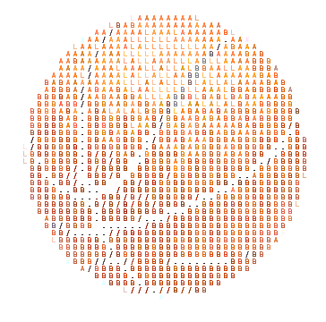

# [hooper](https://icomey8.github.io/hooper/)
> Created by Ian Comey and Jaime Quiogue

## About

Inspired by our love of basketball and how creative it can be in all aspects of the sport, we're setting out to create a JavaScript-like language with some tweaks on syntax and structure.  To make the language more fun and engaging, we've incorporated basketball-related terminology—something fellow fans might appreciate. 

## Features

- static typing (in-progress)
- Control Flow
- AST Optimization

## Keyword Guide

| hooper   | Javascript    |
| -------- | ------------- |
| swish    | true          |
| brick    | false         |
| turnover | break         |
| dunk     | return        |
| pick     | let           |
| define play | func       |
| dribble  | while         |
| reb      | else if       |
| putback  | else          |
| log       | console.log() |

## Example Programs

### hello world
| _Javascript_   | _hooper_    |
| -------- | ------------- |
| `console.log("hello world")` | `log("hello world")`      |

### fibonacci sequence
<table>  
  <tr>  
    <th>JavaScript</th>  
    <th>Hooper</th>  
  </tr>  
  <tr>  
    <td>  

   ```javascript
function fibonacci(n) {  
  let sequence = [0, 1];  
  for (let i = 2; i < n; i++) {  
    sequence.push(sequence[i - 1] + sequence[i - 2]);  
   }  
    return sequence;  
}  
   ```  

   </td>  
    <td>  

 ```python  
 play fibonacci(n)  
   pick sequence = [0, 1]  
   for (i = 2; i < n; i++)  
     sequence.push(sequence[i - 1] + sequence[i - 2])  
     dunk sequence  
 ```  

   </td>  
  </tr>  
</table>  

   
### GCD

<table>  
  <tr>  
    <th>JavaScript</th>  
    <th>Hooper</th>  
  </tr>  
  <tr>  
    <td>  

   ```javascript  
function gcd(a, b) {
    while (b !== 0) {
        [a, b] = [b, a % b];
    }
    return a;
}  
   ```  

   </td>  
    <td>  

 ```python  
    play gcd(a, b) 
        dribble (b !== 0) 
            pick temp = b;
            b = a % b;
            a = temp; 
        dunk a;
 ```  

   </td>  
  </tr>  
</table> 

###  Palindrome

<table>  
  <tr>  
    <th>JavaScript</th>  
    <th>Hooper</th>  
  </tr>  
  <tr>  
    <td>  

   ```javascript  
function isPalindrome(str) {
    let cleanStr = str.toLowerCase().replace(/[^a-z0-9]/g, ''); // Remove non-alphanumeric characters
    return cleanStr === cleanStr.split('').reverse().join('');
}
   ```  

   </td>  
    <td>  

 ```python  
play Palindrome(s) 
    pick ogstr = s.replace(/[^a-zA-Z0-9]/g, '').toLowerCase();
    pick revstr = ogstr.split('').reverse().join('');
    dunk ogstr === revstr;
 ```  

   </td>  
  </tr>  
</table> 


## Infinite Loop

<table>  
  <tr>  
    <th>JavaScript</th>  
    <th>Hooper</th>  
  </tr>  
  <tr>  
    <td>  

   ```javascript  
while (true) {
    console.log("This is an infinite loop!");
}
   ```  

   </td>  
    <td>  

 ```python  
dribble(swish)
  log("infinite dribble loop")
 ```  

   </td>  
  </tr>  
</table> 


## Conditionals

<table>  
  <tr>  
    <th>JavaScript</th>  
    <th>Hooper</th>  
  </tr>  
  <tr>  
    <td>  

   ```javascript  
let num = 0;

if (num > 0) 
    console.log("The number is positive.");
else if (num < 0) {
    console.log("The number is negative.");
} 
else 
    console.log("The number is zero.");
   ```  

   </td>  
    <td>  

 ```python  
pick num = 0;

  shoot (num > 0) 
    log("The number is positive.");
  reb (num < 0) {
    log("The number is negative.");
  putback 
    log("The number is zero.");
 ```  

   </td>  
  </tr>  


